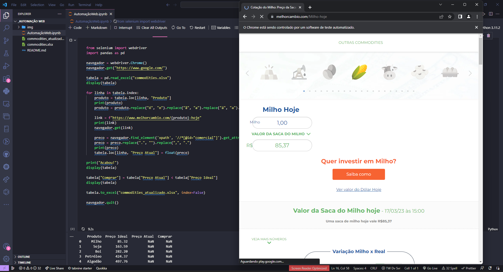
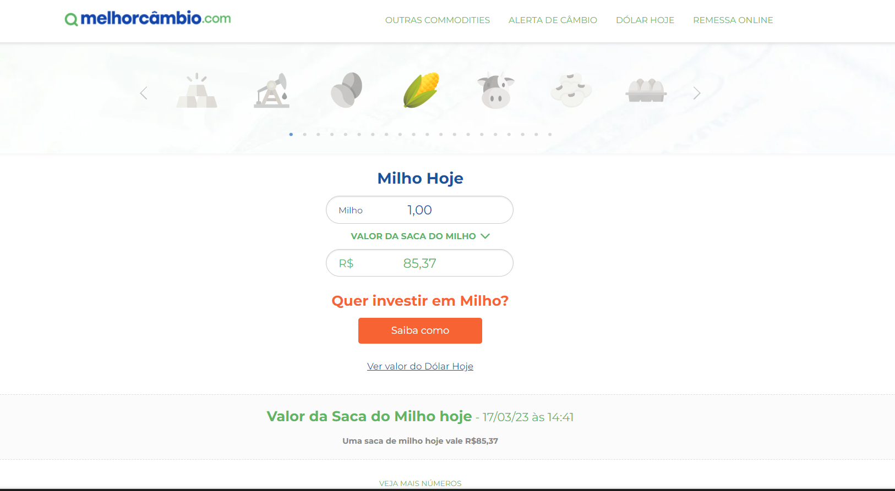
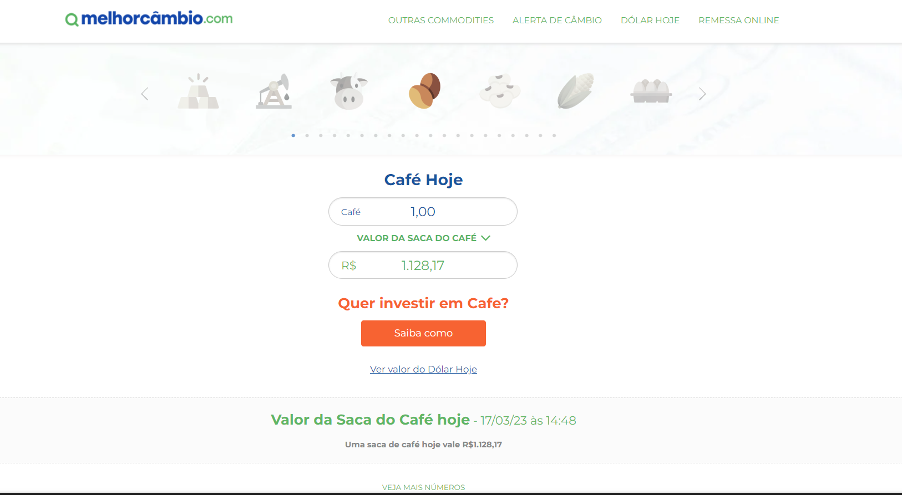
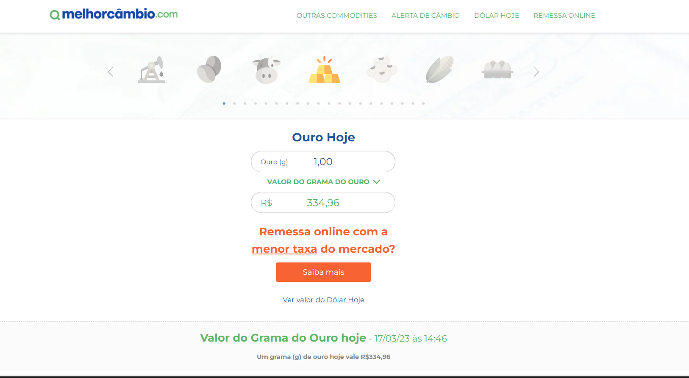
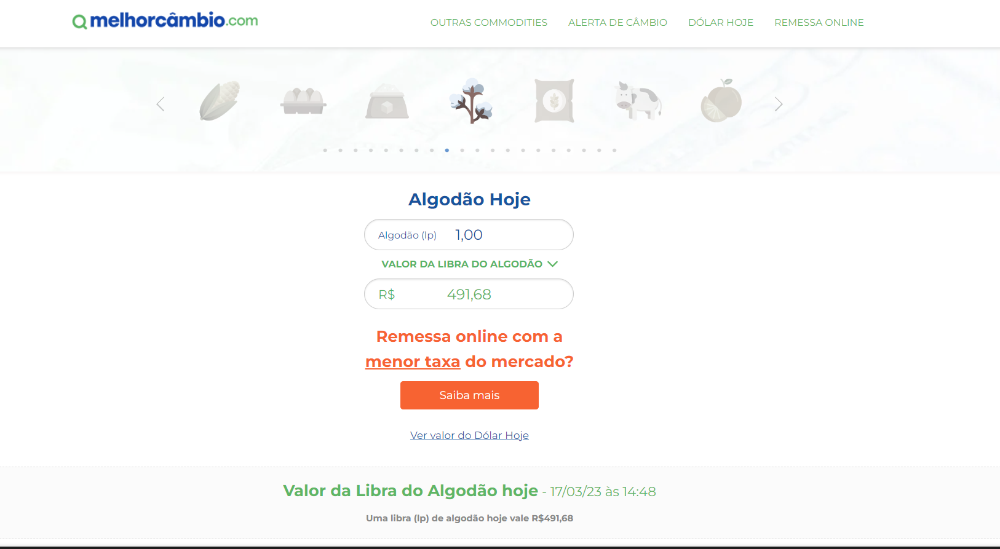
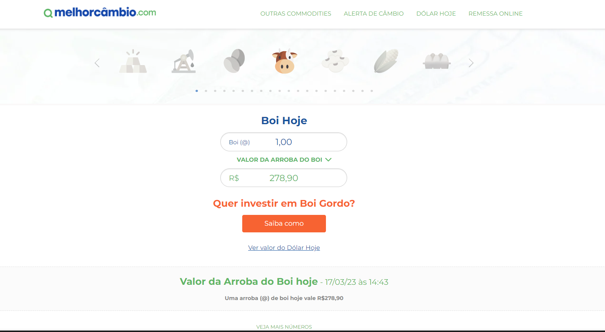
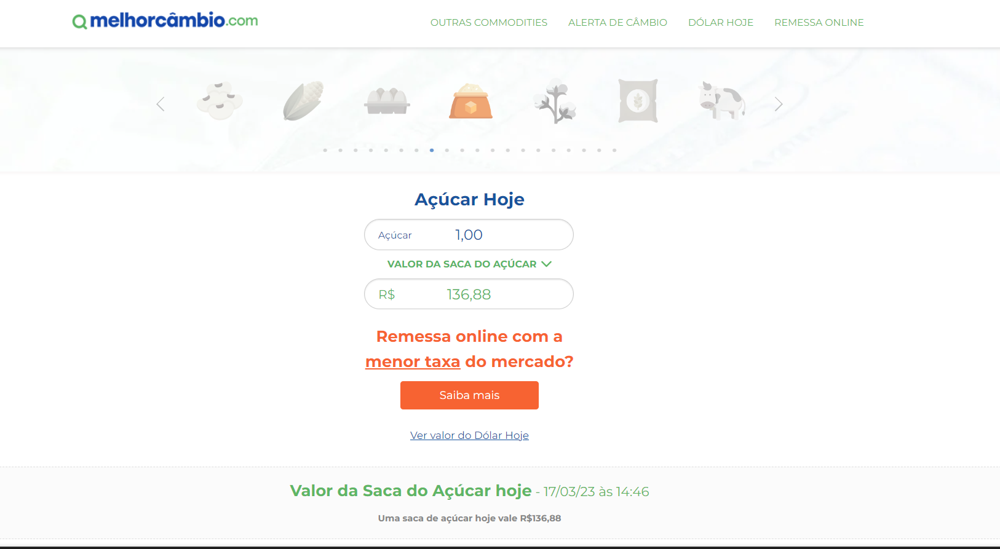
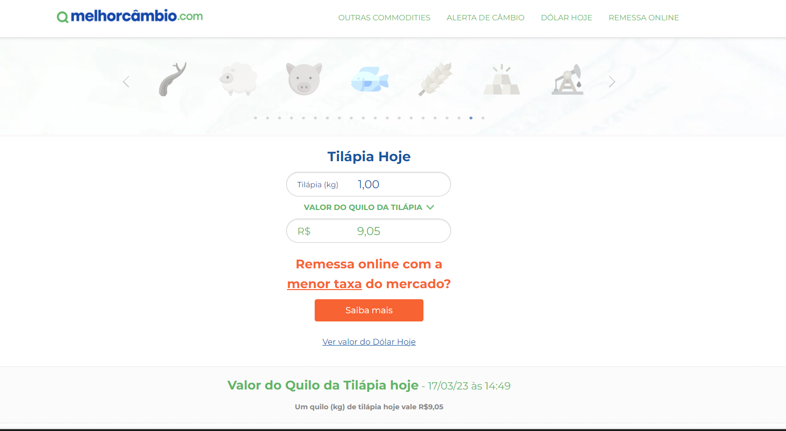

# Automação Web e Busca de Informações com Python

Projeto desenvolvido em Python, junto com a galera do HashTag, para automatizar a cotação dos preços dos produtos de um banco de dados. O código faz a importação da planilha em excel, realizado os tratamento em caracteres especiais, abre o navegador entra no site e para cada produto atualiza o banco de dados e preenche a coluna informando se é viavel ou não comprar o produto.

<!-- Inserir imagem com a #vitrinedev ao final do link -->

## ✔️ Técnicas e tecnologias utilizadas
  - `VSCODE`;
  - `Pyhton`;
  - `GitHub`; 

 

## 📁 Acesso ao projeto

[Veja o projeto final no repositório do GitHub](https://github.com/Thamyresmya/Automacao_Web).

Neste repositório você tem acesso ao banco de dados.

 

## 📚 Cotação dos preços no site: Melhor Câmbio

 

## 📸 Gif
Cotação dos preços em tempo real

 

- Me siga nas redes sociais:
- [Linkedin](https://www.linkedin.com/in/thamyrescavalcante/)
- [Instagran](https://www.instagram.com/thamyres__cavalcante/)

 

---

Feito com ♥ by Thamyres Cavalcante.

